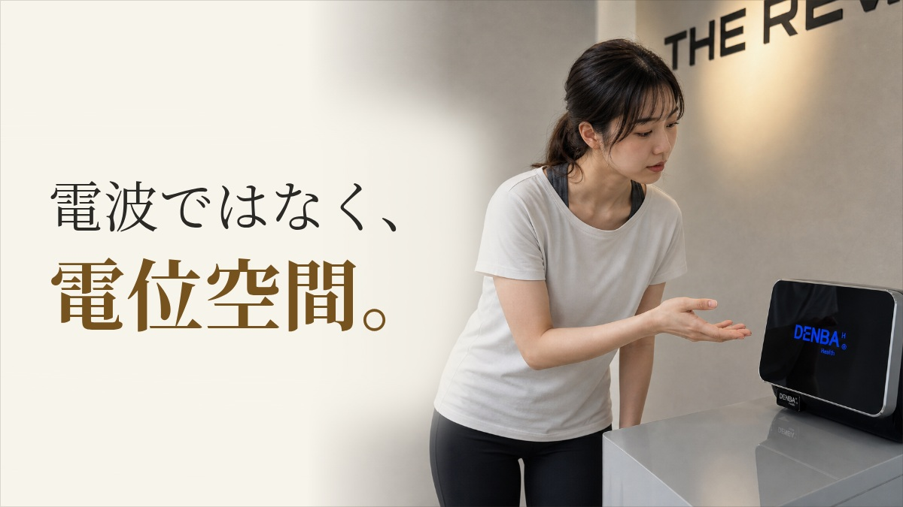
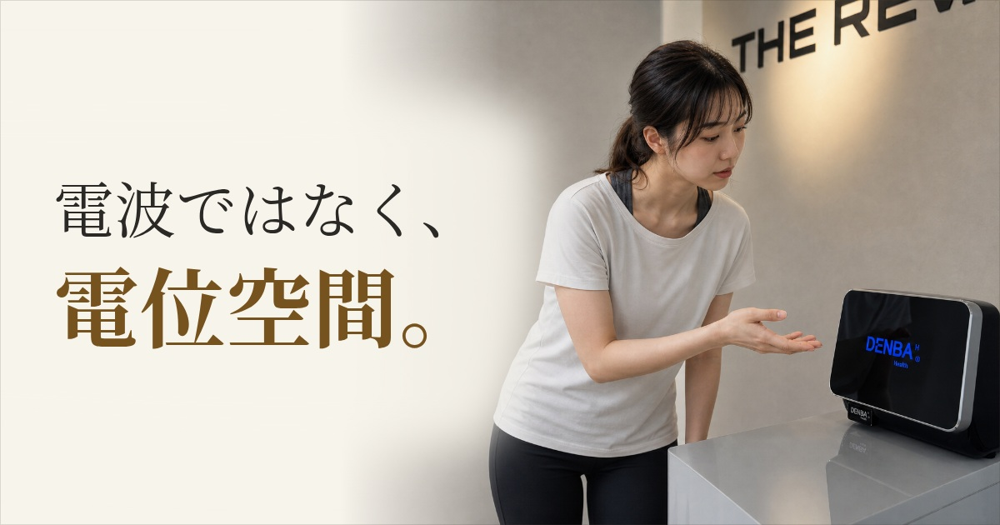
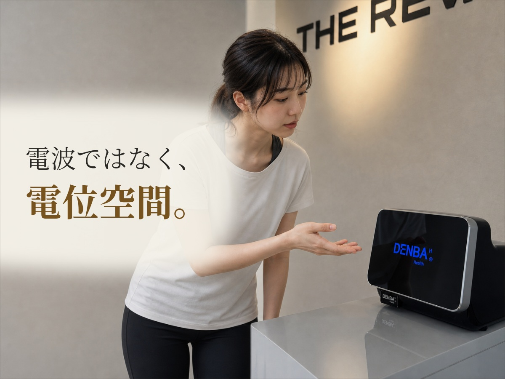

# DENBA Editorial Image Review｜2026-10-04

**Article:** DENBAの電位空間とは？ 電波・EMSと混同しないための基本整理  
**content_id:** BLOG-20261005-ea92d0  
**draft_id:** 38c56810-1275-413c-9dda-2b5c052ff824  
**Human status:** **PENDING**  
**Production:** untouched by this review branch

## Why the previous image was rejected

The previous image made the typography easier to read, but the customer was essentially standing still with both arms down and looking toward the floor/device. The image therefore satisfied “a person exists” and “DENBA exists” without creating a meaningful editorial moment.

The two approved V2.3 references work differently:

- *after-work-tired-strength-training*: the seated posture, towel/water and body language immediately communicate a post-training moment.
- *no-time-for-gym-starting-friction*: the customer is visibly in the act of arriving/preparing, so the article theme is carried by action rather than by a generic portrait.

The regression was caused by the DENBA job itself telling the model to “look at the device” and “keep hands naturally down”, while Human First emphasized a large readable face. Automated QA then incorrectly accepted passive observation as article-specific action.

## Three scene directions considered

### A｜実機へ少し身を寄せ、片手で自然に示す **[採用]**
- **Action:** DENBA本体へ視線と上体を向け、片手を開いて機器を示す。触らない・操作しない。
- **Composition:** medium / medium-close 3/4。顔・手・DENBA本体が同じ視線の流れに入る。
- **Copy:** 「電波ではなく、／電位空間。」
- **Why:** 確認済みDENBA実機だけで成立し、架空の座席・マット・利用姿勢を作らず、「この機器の仕組みを知ろうとしている」行動が読める。

### B｜実機の表示面を近距離で確かめる
- **Action:** 顔と視線を本体正面へ寄せて確認。腕は胸元で自然にまとめる。
- **Composition:** 顔の横顔と本体を近接させる。
- **Copy:** 「EMSとは違う。／DENBAの仕組み」
- **Why:** 誤解整理には強いが、手の動作が少なく、再び“見るだけ”へ退行するリスクがAより高い。

### C｜実機と距離を取り、指先ではなく手のひらで位置を示す
- **Action:** 一歩横から本体を示しながら視線を向ける。
- **Composition:** THE REVサインも含めた少し広い場面。
- **Copy:** 「電位空間を、／まず正しく知る。」
- **Why:** 店舗性は出るが、320pxで行動が弱くなりやすい。

## Verified source boundary

Confirmed source: `the-rev-denba-20260924` / `assets/images/photo-solution-denba.jpg`.

The scoped Drive source root contains no additional verified DENBA seating, mat, or usage-posture image. Therefore this revision deliberately does **not** invent a seat, mat, treatment pose, EMS electrodes, visible electric waves, glow, aura, or claimed physical effect.

## Candidate outputs

### Thumbnail 1200×675

### OGP 1200×630

### GBP 1200×900

## Approval boundary

Automated QA may mark the candidate PASS, but that is not human approval. Until the human reviewer accepts the actual images, this review remains **PENDING**. No merge, production deployment, published-image replacement, article Publish, or production review approval is authorized by this file.
